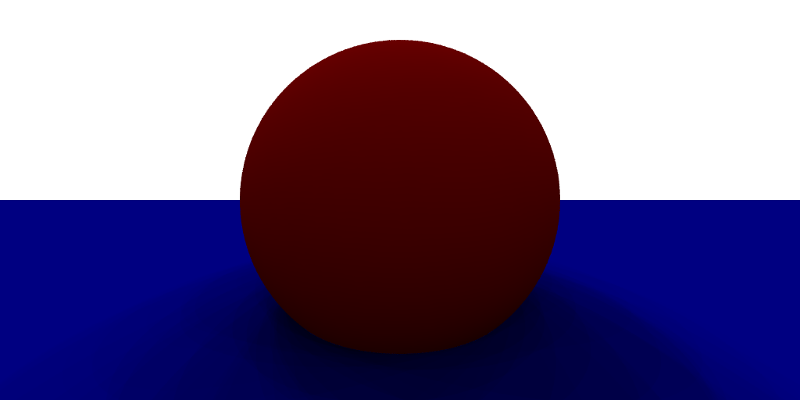
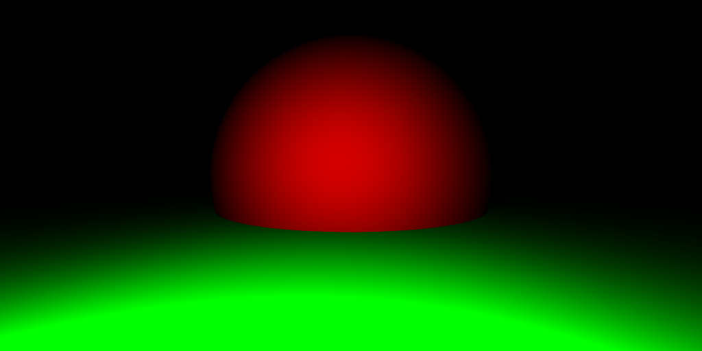
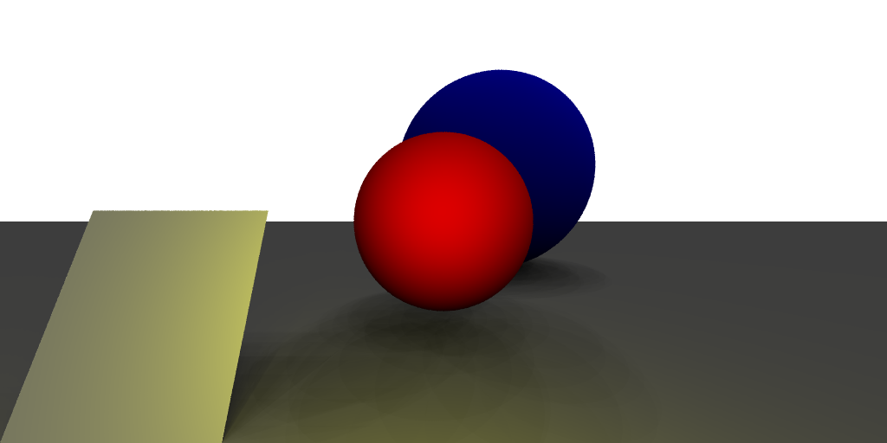

<h1 align="center">📷 Projet Synthèse - Image 📊</h1>

# 🧐 About

Il s'agit d'un projet noté dans le cadre de l'UE "Initiation à l'Analyse et à la Synthèse d'Images" de l'Université Lyon 1.

# Sujet

Le sujet du projet est disponible [ici](https://perso.univ-lyon1.fr/jean-claude.iehl/Public/educ/L3IMAGE/2022/projet.html).

# Comment run le projet

Ouvrir le terminal dans le dossier du projet et lancer la commande suivante : `make tp -j4 && bin/tp`.

Cette commande va compiler le projet et exécuter le programme. Une image `image.png` sera alors générée.

# Structure du projet

Le fichier `projets/tp.cpp` contient le code principal du projet. C'est dans ce fichier et dans la fonction `main()` que l'on définit la scène, les objets et les sources lumineuses.

# Ce qui a été fait

### 1. Les choix de conception

- Création de structure de données pour tous les éléments nécessaires au rendu de l'image :

  - Plan
  - Sphère
  - Panneau
  - Scène
  - Source
  - Hit (pour les intersections)
  - ...

- Création de fonctions d'intersection entre les rayons et les objets de la scène :

  - intersect_plan
  - intersect_sphere
  - intersect_panneau
  - ...

- Création de fonctions de calcul de la couleur d'un pixel :

  - computePixelColorDome
  - computePixelColorSources

### 2. Les fonctionnalités implémentées

- Plusieurs types de sources lumineuses :

  - Source ponctuelle
  - Spot (panneau)
  - Dome

- Plusieurs types d'objets :

  - Plan
  - Sphère
  - Panneau

- Antialiasing :

  - en générant plusieurs rayons dans un pixel et en calculant la moyenne des couleurs

- Ombres :

  - en vérifiant si le rayon intersecte un objet avant d'atteindre la source lumineuse

### 3. Exemple d'images générées

 

- Sphère rouge, Plan bleu et source lumineuse ponctuelle blanche
  

  

- Sphère rouge, Plan bleu et source lumineuse dome (blanche)
  

  

- Sphère rouge, Plan vert et source lumineuse spot (blanche)
  

     

- Spères rouge et bleue, Plan gris, Panneau blanc et sources lumineuses multiples (dome blanc et spot jaune)
  

     

# Les améliorations que l'on aurait souhaité apporter

- Ajouter des miroirs
- Ajouter une profondeur de champ
- Ajouter d'autres objets (cylindre, cube, ...)
- Faire un code plus propre et plus modulaire (utilisation de classes)

# Difficultés rencontrées et essais

- Nous avons eu du mal à comprendre comment implémenter les reflets et miroirs dans le projet. Nos rayons réfléchis ne donnaient pas le résultat attendu (mauvais placement des objets, couleurs incohérentes, ...).
  Nous avons donc décidé de ne pas les implémenter.
  Peut-être qu'un TP spécialement dédié aux reflets et miroirs nous aurait aidé à mieux comprendre comment les implémenter dans le projet.

# Ce que l'on aurait souhaité voir durant cette UE

- Comment ajouter et manipuler des textures sur les objets.
- Comment implémenter les déplacements de caméra, pour pouvoir se déplacer dans la scène.
- Être plus guidé sur les choix de conception à faire pour avoir un code plus propre.

# Ce que l'on a aimé durant cette UE

- L'aspect pratique de l'UE, avec la réalisation d'un projet.
- Les nombreux TP permettent de mieux comprendre les notions et de les retenir, c'est très appréciable.
- Le sujet du projet est intéressant et nous a permis d'explorer plusieurs aspects de la synthèse d'image.

# ✍️ Contributeurs

- [Benjamin BOULET](https://forge.univ-lyon1.fr/p2006010) : p2006010
- [Lucas FAUSTMANN](https://forge.univ-lyon1.fr/p2020351) : p2020351
